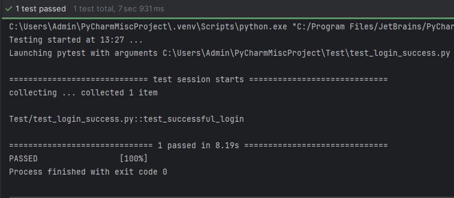
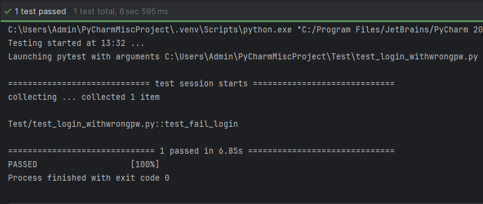
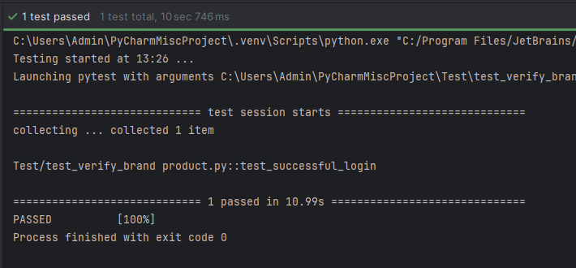
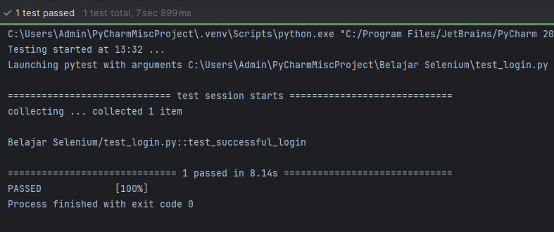
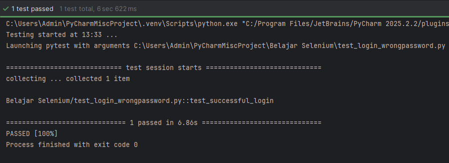

# web-automation-selenium-python
Automated functional testing for E-commerce web applications using Selenium Python. Covers end-to-end scenarios from registration to checkout

Project ini merupakan kumpulan script otomatisasi pengujian (Automation Testing) untuk website E-Commerce menggunakan **Python** dan **Selenium**. Project ini fokus pada pengujian alur fungsionalitas utama (Critical Path) untuk memastikan aplikasi berjalan dengan baik.

## 🚀 Fitur yang Diuji
Script ini mencakup berbagai skenario pengujian, antara lain:
* **Autentikasi:** Registrasi akun baru, login (email benar/salah), dan logout.
* **Manajemen Produk:** Pencarian produk, melihat detail produk, serta verifikasi produk berdasarkan kategori dan brand.
* **Transaksi & Interaksi:** Menambah produk ke keranjang, menghapus produk dari keranjang, dan mengirim formulir kontak.

## 🛠️ Teknologi yang Digunakan
* **Bahasa Pemrograman:** Python
* **Library:** Selenium WebDriver
* **Browser:** Chrome/Edge (sesuai driver yang digunakan)

## 📁 Struktur File
* `Register.py`: Menguji alur pendaftaran user baru.
* `Login with correct email & password.py`: Menguji akses masuk dengan kredensial valid.
* `Add Product in Cart.py`: Menguji fungsionalitas keranjang belanja.
* `Verify Search Product.py`: Menguji fitur pencarian barang.
* Dll

## 📊 Screenshots

<b>📷 Click to view Screenshots </b>

 

<b>📷 With POM  </b>

 

### With POM Verify Login Success

### With POM Verify Login Failed

### With POM Verify Brand Product

<b>📷 Without POM </b>

 
   
### Without POM Verify Login Success

### Without POM Verify Login Failed

### Without POM Verify Form Contact Us

## 📈 Pengembangan Selanjutnya (Roadmap)
Project ini adalah versi awal (Milestone 1). Rencana pengembangan berikutnya:
- [ ] Implementasi **Page Object Model (POM)** untuk efisiensi kode.
- [ ] Integrasi dengan **Pytest** sebagai framework testing.
- [ ] Pembuatan laporan pengujian otomatis menggunakan **Allure Report**.

---
*Dibuat untuk tujuan pembelajaran dan pengembangan portofolio QA.*
